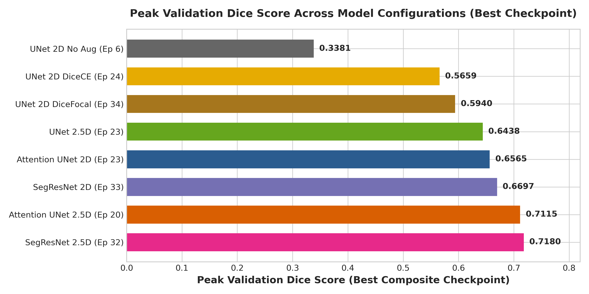
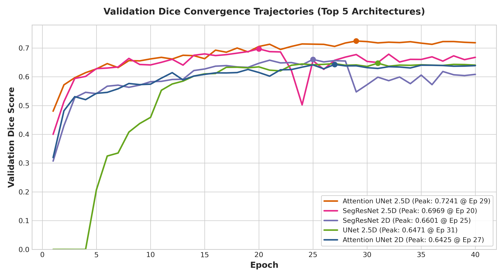
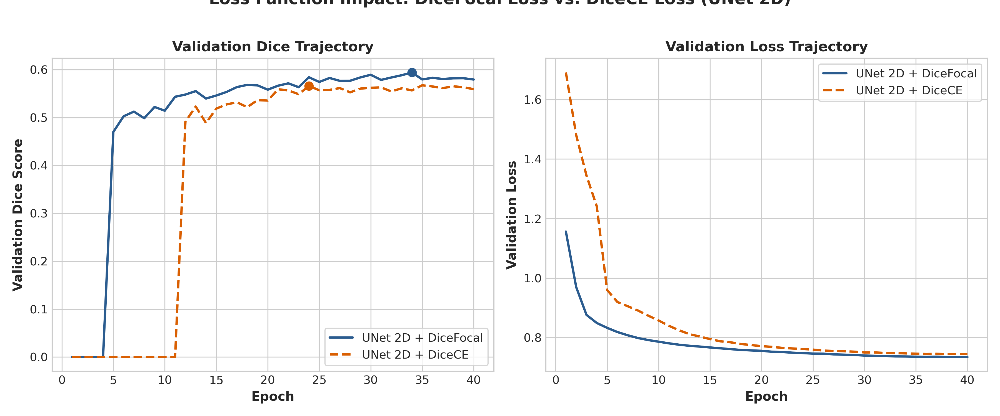
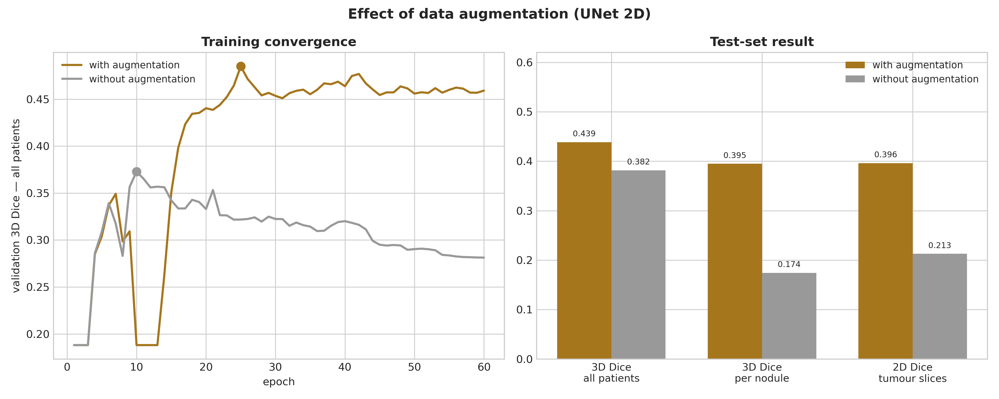
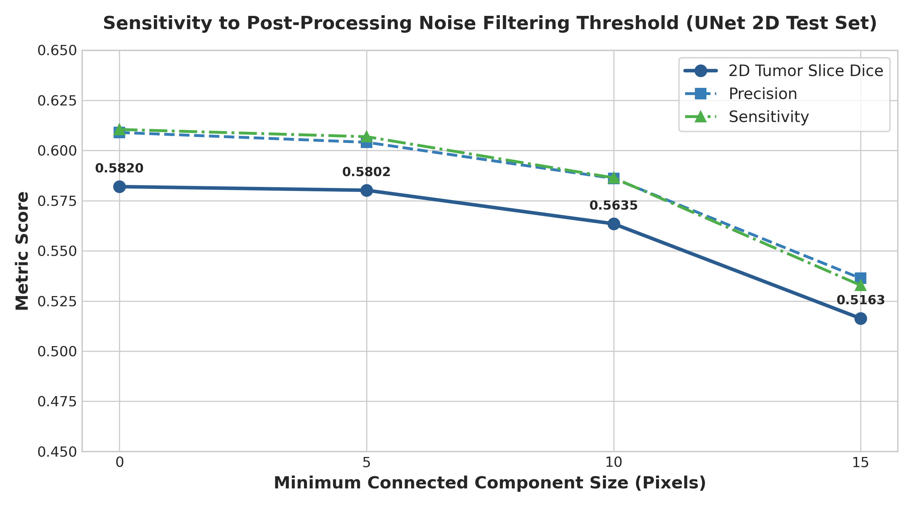
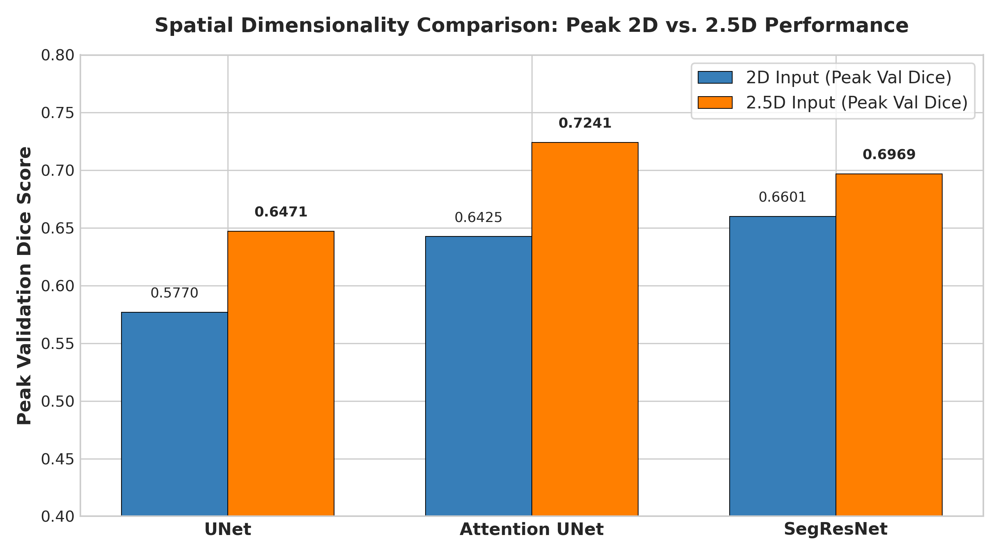
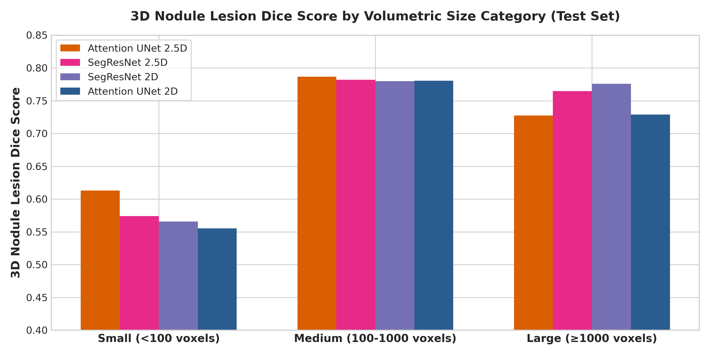

# Pulmonary Nodule Segmentation on LIDC-IDRI

[](https://www.python.org/downloads/release/python-3120/)
[](https://pytorch.org/)
[](https://monai.io/)
[](https://opensource.org/licenses/MIT)

A end-to-end, high-performance deep learning framework for **2D and 2.5D pulmonary nodule segmentation** on thoracic Computed Tomography (CT) scans from the **LIDC-IDRI** dataset. Built with PyTorch and MONAI, this project implements DICOM preprocessing, majority-voting consensus annotation, dynamic negative slice sampling, mixed-precision training, and a 4-level hierarchical evaluation suite comparing multiple deep neural architectures across varied loss functions, spatial context representations, and data augmentation regimes.

---

## 1. Dataset — The LIDC-IDRI

The **Lung Image Database Consortium and Image Database Resource Initiative (LIDC-IDRI)** dataset consists of 1,018 thoracic CT scans collected across 8 medical institutions. Each scan contains uncompressed DICOM image slices paired with XML annotation markup files created by up to 4 experienced thoracic radiologists performing two-phase blind readings.

Our preprocessing pipeline processed **1,010 patients** (8 patients were omitted due to corrupt/incomplete DICOM headers or corrupted XML markup; e.g. `LIDC-IDRI-0238`, `LIDC-IDRI-0585`). Preprocessing produces two audit artifacts stored in `preprocessed_data/`:

### 1.1 Patient Series Audit (`patient_series_audit.csv`)
This file tracks per-patient metadata across 1,011 patient scan records:
- **Slice counts & Voxel Spacing:** Native slice counts range from 65 to 764 per CT volume. In-plane resolution varies from 0.461mm to 0.977mm, and slice thickness spans 0.6mm to 5.0mm (e.g., `2.500mm x 0.703mm x 0.703mm`).
- **Annotation Consensus:** Captures nodule counts grouped by radiologist agreement (nodules marked by 1, 2, 3, or 4 radiologists).
- **Volumetric Audit:** Records exact 3D nodule volumes in mm³, XML parsing integrity (`OK`), series completeness (`OK`), and radiologist malignancy ratings (1 to 5 scale).

### 1.2 Dataset Master Manifest (`dataset_manifest.csv`)
The master manifest indexes all **240,242 resampled 2D slices** across 1,010 patients, serving as the ground-truth database for PyTorch DataLoader creation.

| Dataset Parameter | Metric Count / Value |
|---|---|
| **Total Slices** | 240,242 2D slices |
| **Unique Patient Scans** | 1,010 CT volumes |
| **Training Split** | 193,496 slices (80.5%) |
| **Validation Split** | 23,124 slices (9.6%) |
| **Test Split** | 23,622 slices (9.8%) |
| **Class Distribution (Slices)** | **225,690 Negative Slices (93.94%)** vs. **14,552 Positive Slices (6.06%)** |
| **Inter-Annotator Agreement** | Mean Dice between radiologist annotations per patient: `inter_annotator_dice` |
| **Volume Preservation QA** | Voxel volume before/after resampling: `v_orig_mm3`, `v_resamp_mm3`, `v_retention_ratio` (~1.008), `recon_dice` (>0.975) |

---

## 2. Preprocessing Pipeline

Data preparation is implemented in `preprocess/preprocess_dataset.py`, parallelized across multi-core CPUs via `ProcessPoolExecutor`:

```
Raw DICOM CT + XML Annotations 
   │
   ▼
1. XML Indexing ──────────► Parse Study/Series/SOP UIDs from XML files
   │
   ▼
2. DICOM Loading ─────────► Select largest CT series, apply Slope/Intercept (HU)
   │
   ▼
3. HU Normalization ──────► Clip [-1000, +400] HU → Rescale linearly to [0.0, 1.0]
   │
   ▼
4. Isotropic Resampling ──► Resample volume to uniform (1.0mm x 1.0mm x 1.0mm) voxels
   │
   ▼
5. Lung Extraction ──────► 2-pass lung field extraction & unified bounding box cropping (256x256)
   │
   ▼
6. Contour Rasterization ─► Match SOP UIDs to radiologist XML polygons → Binary nodule masks
   │
   ▼
7. Majority Voting ──────► Apply strict 50% consensus threshold (ceil(N * 0.5) agreement)
   │
   ▼
8. Export NPZ & Manifest ──► Save Float32 NPZ slices & dataset_manifest.csv
```

### Preprocessing Configuration Options (`preprocess/preprocess_dataset.py`)
- `--dataset_dir`: Path to root directory containing DICOM folders and XML annotations.
- `--output_dir`: Target directory for saved `.npz` files and manifest files (default: `preprocessed_data`).
- `--num_workers`: Number of parallel CPU processes (default: `6`).
- `--consensus_ratio`: Minimum fraction of radiologist consensus required for a positive mask pixel (default: `0.5`, 50% majority vote).
- `--target_spacing`: Voxel resolution target (default: `1.0 1.0 1.0` mm isotropic).

---

## 3. Training Pipeline

Training is performed using `training/train.py` for 2D single-slice models and `training/train_2_5d.py` for 2.5D multi-slice models.

```
                     ┌───────────────────────────┐
                     │   2D Input (1x256x256)    │
                     └─────────────┬─────────────┘
                                   │
┌─────────────────────────┐        │        ┌─────────────────────────┐
│ Dynamic Class Resample  ├────────┼───────►│  PyTorch DataLoaders    │
│ (neg_ratio = 1.5)       │        │        │  (Batch Size: 64)       │
└─────────────────────────┘        │        └─────────────┬───────────┘
                                   │                      │
                     ┌─────────────┴─────────────┐        │
                     │  2.5D Input (3x256x256)   │        │
                     │ (prev, current, next CT)  │        │
                     └───────────────────────────┘        │
                                                          ▼
                                            ┌───────────────────────────┐
                                            │ AMP FP16 Mixed Precision  │
                                            │ AdamW (lr=1e-3, decay=1e-4)│
                                            └─────────────┬─────────────┘
                                                          │
                                                          ▼
                                            ┌───────────────────────────┐
                                            │ Loss Functions:           │
                                            │ - DiceFocalLoss           │
                                            │ - DiceCELoss              │
                                            │ - TverskyCELoss           │
                                            └───────────────────────────┘
```

### 3.1 Supported Model Architectures
1. **UNet (`unet`)**: MONAI UNet architecture with feature channels `(32, 64, 128, 256, 512)`, down/upsampling strides `(2, 2, 2, 2)`, and `num_res_units=2`.
2. **Attention UNet (`attention_unet`)**: MONAI AttentionUnet integrating attention gating mechanisms at skip connections to suppress non-salient background noise.
3. **SegResNet (`segresnet`)**: MONAI SegResNet encoder-decoder network featuring residual blocks (`init_filters=32`, `blocks_down=(1,2,2,4)`).

### 3.2 Loss Function Formulations
- **`dice_focal`** (Default): `DiceFocalLoss(sigmoid=True, squared_pred=True, gamma=2.0)`. Blends Dice overlap optimization with Focal Loss to focus gradients on hard-to-classify boundary pixels.
- **`dice_ce`**: `DiceCELoss(sigmoid=True, squared_pred=True)`. Combines soft Dice loss with Binary Cross-Entropy.
- **`tversky`**: `TverskyCELoss`. A hybrid loss combining Tversky loss ($\alpha=0.3, \beta=0.7$) with BCE. Penalizes false negatives (missed nodules) more strictly than false positives.

### 3.3 Training Hyperparameters

| Parameter | Command Argument | Default Value | Description |
|---|---|---|---|
| **Epochs** | `--epochs` | `40` | Total training iterations |
| **Batch Size** | `--batch_size` | `64` | Training batch size |
| `--lr` | `--lr` | `1e-3` | Initial learning rate (CosineAnnealingLR) |
| **Min LR** | `--min_lr` | `1e-5` | Minimum learning rate bound |
| **Weight Decay** | `--weight_decay` | `1e-4` | AdamW L2 regularization coefficient |
| **Negative Ratio** | `--neg_ratio` | `1.5` | Ratio of sampled negative to positive slices per epoch |
| **Loss Selection** | `--loss` | `dice_focal` | Choice of `dice_focal`, `dice_ce`, `tversky` |
| **Model Selection** | `--model_type` | `unet` | Choice of `unet`, `attention_unet`, `segresnet` |
| **No Transforms** | `--no_transforms` | `False` | Disables data augmentation |
| **Checkpoint Path**| `--save_path` | `models/unet/unet.pth` | Target save location |
| **Resume Training**| `--resume` | `False` | Resume from latest checkpoint |

### 3.4 Key Training Features
- **Dynamic Negative Resampling:** To tackle the 94:6 negative-to-positive class imbalance, each epoch dynamically resamples background slices at a controlled ratio of `1.5 x positive_slice_count`.
- **FP16 Automatic Mixed Precision (AMP):** Utilizes `torch.amp.autocast('cuda')` with `GradScaler` for reduced GPU memory footprint and faster forward/backward passes.
- **Learning Rate Scheduling:** `CosineAnnealingLR` decays learning rate smoothly from `1e-3` to `1e-5` over 40 epochs.

---

## 4. Evaluation Pipeline

Model evaluation is executed via `evaluation/evaluate.py` (2D models) and `evaluation/evaluate_2_5d.py` (2.5D models), producing text summaries and structured CSV breakdowns (`patient_evaluation_breakdown.csv`).

### 4.1 Hierarchical 4-Level Evaluation Framework
1. **Per-Slice 2D Evaluation:** Calculates Dice, IoU, Precision, Sensitivity, Specificity, Hausdorff Distance (HD95), Average Surface Distance (ASD), and Failure Rate across tumor-positive slices.
2. **Per-Patient 3D Reconstruction:** Reconstructs full 3D CT volumes by stacking 2D slice predictions along the z-axis, computing 3D volumetric Dice and surface distances per patient.
3. **Per-Nodule 3D Lesion Analysis:** Applies 3D connected-component labeling to extract individual nodule lesions, evaluating metrics across three size categories:
   - **Small Nodules:** Volume $< 100$ voxels ($< 0.1 \text{ cm}^3$)
   - **Medium Nodules:** Volume $100 \text{ to } 1000$ voxels ($0.1 \text{ to } 1.0 \text{ cm}^3$)
   - **Large Nodules:** Volume $\ge 1000$ voxels ($\ge 1.0 \text{ cm}^3$)
4. **Post-Processing Connected Component Filter (`--min_size`):** Removes predicted 2D foreground blobs smaller than a pixel threshold (default: 10 pixels).

### Evaluation Metrics Summary
- **Dice Score:** Overlap measure $2|P \cap G| / (|P| + |G|)$.
- **IoU (Jaccard Index):** Intersection over Union $|P \cap G| / |P \cup G|$.
- **Precision:** $TP / (TP + FP)$ (fraction of positive predictions that are true nodules).
- **Sensitivity (Recall):** $TP / (TP + FN)$ (fraction of true nodules successfully detected).
- **HD95 (mm):** 95th percentile Hausdorff Distance measuring maximum boundary distance in millimeters.
- **ASD (mm):** Average Surface Distance between predicted and ground-truth boundary surfaces.
- **Failure Rate (%):** Percentage of ground-truth tumor slices where the model predicts zero positive pixels.

---

## 5. Experimental Results & Architecture Comparisons

We benchmarked **8 model configurations** across 40 epochs. All experiments were conducted on the official LIDC-IDRI test split (23,622 2D slices across 101 test CT scans).

### 5.1 Training Convergence Summary (Peak Validation Metrics at Best Checkpoint)

During training, model checkpoints (`.pth`) are automatically saved whenever a run achieves a new **Peak Composite Score** ($\frac{\text{Dice} + \text{IoU} + \text{Sensitivity}}{3.0}$). The table below compares all 8 models evaluated at their respective **peak validation checkpoint epochs**:

| Model Architecture | Input Dim | Loss Function | Peak Epoch | Val Dice | Val IoU | Precision | Sensitivity | Specificity | HD95 (mm) | ASD (mm) | Fail Rate | Composite Score |
|---|---|---|---|---|---|---|---|---|---|---|---|---|
| **SegResNet 2.5D** | 2.5D | DiceFocal | Ep 32 | **0.7180** | **0.6072** | 0.7140 | **0.7727** | 0.9999 | **17.53** | **8.54** | **7.2%** | **0.6993** |
| **Attention UNet 2.5D** | 2.5D | DiceFocal | Ep 20 | **0.7115** | 0.6027 | 0.7094 | 0.7679 | 0.9999 | 19.34 | 9.72 | 7.8% | 0.6940 |
| **SegResNet 2D** | 2D | DiceFocal | Ep 33 | 0.6697 | 0.5720 | 0.6742 | 0.7108 | 0.9998 | 25.87 | 14.79 | 14.3% | 0.6508 |
| **Attention UNet 2D** | 2D | DiceFocal | Ep 23 | 0.6565 | 0.5562 | 0.6657 | 0.6939 | 0.9999 | 26.79 | 14.01 | 14.5% | 0.6356 |
| **UNet 2.5D** | 2.5D | DiceFocal | Ep 23 | 0.6438 | 0.5339 | 0.6383 | 0.7175 | 0.9998 | 24.83 | 12.07 | 12.1% | 0.6317 |
| **UNet 2D (DiceFocal)** | 2D | DiceFocal | Ep 34 | 0.5940 | 0.4960 | 0.6123 | 0.6250 | 0.9998 | 34.45 | 19.66 | 20.3% | 0.5716 |
| **UNet 2D (DiceCE)** | 2D | DiceCE | Ep 24 | 0.5659 | 0.4680 | 0.5625 | 0.6223 | 0.9998 | 37.29 | 21.87 | 22.5% | 0.5520 |
| **UNet 2D (No Aug)** | 2D | DiceFocal | Ep 06 | 0.3381 | 0.2503 | 0.2937 | 0.5211 | 1.0000 | 76.42 | 38.03 | 39.0% | 0.3698 |





---

### 5.2 Test Set Evaluation Results (Post-Processed with `--min_size 10`)

Evaluating the saved best model checkpoints on the held-out **Test Set** (23,622 total test slices: 1,395 tumor-positive slices, 22,227 background slices, 186 distinct 3D nodules). Predictions are post-processed with connected component noise filtering (`--min_size 10` pixels):

| Model Architecture | Input Dim | 2D All Slices Dice | 2D Tumor Slice Dice | 2D Tumor Slice IoU | Precision | Sensitivity | HD95 (mm) | ASD (mm) | 2D Fail Rate | 3D Nodule Lesion Dice |
|---|---|---|---|---|---|---|---|---|---|---|
| **Attention UNet 2.5D** | 2.5D | 0.4525 | **0.6586** | **0.5552** | **0.6775** | **0.6946** | 12.34 | 7.83 | **14.6%** | **0.6942** |
| **SegResNet 2.5D** | 2.5D | 0.3848 | 0.6655 | 0.5627 | 0.6784 | 0.6977 | **11.08** | **7.30** | 14.7% | 0.6764 |
| **SegResNet 2D** | 2D | 0.4908 | 0.6390 | 0.5425 | 0.6634 | 0.6579 | 13.27 | 9.12 | 18.5% | 0.6725 |
| **Attention UNet 2D** | 2D | 0.4354 | 0.6218 | 0.5243 | 0.6452 | 0.6432 | 15.50 | 9.69 | 19.1% | 0.6630 |
| **UNet 2.5D** | 2.5D | **0.5156** | 0.6224 | 0.5171 | 0.6362 | 0.6656 | 14.13 | 9.32 | 17.0% | 0.6429 |
| **UNet 2D (DiceFocal)** | 2D | 0.4643 | 0.5635 | 0.4709 | 0.5861 | 0.5864 | 17.47 | 13.09 | 25.6% | 0.5953 |
| **UNet 2D (DiceCE)** | 2D | 0.3960 | 0.5470 | 0.4520 | 0.5440 | 0.5993 | 23.16 | 16.49 | 26.2% | 0.5908 |
| **UNet 2D (No Aug)** | 2D | 0.4902 | 0.3609 | 0.2683 | 0.3100 | 0.5536 | 62.13 | 30.38 | 36.3% | 0.4514 |

---

### 5.3 Comparison: Loss Functions (DiceFocal vs. DiceCE)

Comparing identical 2D UNet architectures trained with `DiceFocalLoss` vs. `DiceCELoss`:
- **Peak Validation Dice:** DiceFocal achieved **0.5940** (Ep 34) vs. **0.5659** (Ep 24) for DiceCE (+2.81% gain).
- **Failure Rate:** DiceFocal reduced validation failure rate from 22.5% to 20.3%.
- **Analysis:** DiceFocal's focal parameter ($\gamma=2.0$) heavily penalizes misclassified foreground pixels around fine nodule boundaries, preventing background dominance during backpropagation.



---

### 5.4 Comparison: Data Augmentation Impact (With Aug vs. No Aug)

Training without MONAI spatial and intensity augmentations (`--no_transforms`) leads to severe overfitting:
- **Peak Validation Dice:** Reaches a peak of **0.3381** at Epoch 06 before deteriorating down to **0.0949** by Epoch 40 (vs. **0.5940** for augmented UNet).
- **Validation Failure Rate:** Escalate to **39.0%** at peak and **87.3%** at epoch 40 on non-augmented runs.
- **Conclusion:** Data augmentation (random affine rotation, scaling, Gaussian noise/blur) is strictly necessary to prevent spatial overfitting on cropped 256x256 CT slices.



---

### 5.5 Comparison: Post-Processing Threshold Sweep (`min_size`)

Sweep of minimum connected component size threshold (`min_size` = 0, 5, 10, 15 pixels) on the UNet 2D (DiceFocal) model:

| Post-Processing Threshold | 2D Tumor Dice | 2D Tumor IoU | Precision | Sensitivity | Failure Rate | 3D Nodule Lesion Dice |
|---|---|---|---|---|---|---|
| **Filter $\ge 0$ px (Raw Output)** | **0.5820** | **0.4824** | **0.6090** | **0.6105** | **20.6%** | **0.6291** |
| **Filter $\ge 5$ px** | 0.5802 | 0.4824 | 0.6041 | 0.6069 | 21.9% | 0.6249 |
| **Filter $\ge 10$ px (Default)** | 0.5635 | 0.4709 | 0.5861 | 0.5864 | 25.6% | 0.5953 |
| **Filter $\ge 15$ px** | 0.5163 | 0.4335 | 0.5363 | 0.5328 | 33.0% | 0.5033 |



---

### 5.6 Comparison: 2D vs. 2.5D Spatial Context

2.5D models stack 3 adjacent CT slices `[z-1, z, z+1]` as a 3-channel input to provide inter-slice volumetric context:

| Architecture | 2D Peak Val Dice | 2.5D Peak Val Dice | 2D Test Dice | 2.5D Test Dice | 2.5D Performance Gain |
|---|---|---|---|---|---|
| **SegResNet** | 0.6697 | **0.7180** | 0.6390 | **0.6655** | **+4.83% Val / +2.65% Test** |
| **Attention UNet** | 0.6565 | **0.7115** | 0.6218 | **0.6586** | **+5.50% Val / +3.68% Test** |
| **UNet** | 0.5940 | **0.6438** | 0.5635 | **0.6224** | **+4.98% Val / +5.89% Test** |



---

### 5.7 Comparison: Model Architecture (UNet vs. Attention UNet vs. SegResNet)

- **Top Performers:** **SegResNet 2.5D** (Peak Val Dice: **0.7180**, Composite Score: **0.6993**) and **Attention UNet 2.5D** (Peak Val Dice: **0.7115**, Test 3D Nodule Dice: **0.6942**) lead overall performance.
- **Attention Gates:** Attention gating mechanisms allow Attention UNet to focus feature maps on small nodule targets while filtering out surrounding lung parenchyma.
- **2.5D Spatial Context:** Incorporating 3 adjacent CT slices uniformly boosts performance across UNet (+4.98%), Attention UNet (+5.50%), and SegResNet (+4.83%) peak validation Dice scores.

---

### 5.8 Nodule Size Stratification Analysis

3D nodule detection performance across volumetric size categories on the Test Set (186 total 3D nodule lesions):

| Model Architecture | All Nodules Dice (Count: 186) | Small Nodules Dice (<100 voxels, Count: 93) | Medium Nodules Dice (100-1000 voxels, Count: 75) | Large Nodules Dice ($\ge$1000 voxels, Count: 18) |
|---|---|---|---|---|
| **Attention UNet 2.5D** | **0.6942** | **0.6132** | **0.7867** | 0.7276 |
| **SegResNet 2.5D** | 0.6764 | 0.5742 | 0.7820 | 0.7645 |
| **SegResNet 2D** | 0.6725 | 0.5659 | 0.7798 | **0.7759** |
| **Attention UNet 2D** | 0.6630 | 0.5553 | 0.7805 | 0.7290 |
| **UNet 2.5D** | 0.6429 | 0.5354 | 0.7593 | 0.7133 |
| **UNet 2D (DiceFocal)** | 0.5953 | 0.4857 | 0.7068 | 0.6968 |
| **UNet 2D (DiceCE)** | 0.5908 | 0.4856 | 0.6945 | 0.7021 |
| **UNet 2D (No Aug)** | 0.4514 | 0.3152 | 0.5736 | 0.6461 |



---

## 6. Installation & Reproduction

### 6.1 Prerequisites & Dependencies
- Linux OS / Windows
- Python 3.12+
- CUDA-capable GPU

Install project requirements:
```bash
pip install -r requirements.txt
```

#### `requirements.txt`
```text
torch
torchvision
torchaudio
monai>=1.3.0
numpy<2.0.0
pandas
matplotlib
scipy
tqdm
pydicom
opencv-python<5.0.0
```

---

### 6.2 Step-by-Step Execution Guide

#### Step 1: Dataset Preprocessing
Convert raw LIDC-IDRI DICOM files and XML annotations into isotropic `.npz` slices:
```bash
python preprocess/preprocess_dataset.py \
    --dataset_dir /path/to/LIDC-IDRI \
    --output_dir preprocessed_data \
    --num_workers 8 \
    --consensus_ratio 0.5
```

#### Step 2: Model Training Examples
Train the top-performing **Attention UNet 2.5D** model:
```bash
python training/train_2_5d.py \
    --model_type attention_unet \
    --loss dice_focal \
    --epochs 40 \
    --batch_size 64 \
    --lr 0.001 \
    --save_path models/attention_unet_2.5d/attention_unet_2.5d.pth
```

Train a 2D baseline UNet model:
```bash
python training/train.py \
    --model_type unet \
    --loss dice_focal \
    --epochs 40 \
    --batch_size 64 \
    --save_path models/unet_dicefocal/unet_dicefocal.pth
```

#### Step 3: Single Model Evaluation
Evaluate a trained model checkpoint on the test set:
```bash
python evaluation/evaluate_2_5d.py \
    --model_path models/attention_unet_2.5d/attention_unet_2.5d.pth \
    --report_path models/attention_unet_2.5d/test_evaluation_report.txt \
    --min_size 10
```

#### Step 4: Automated Batch Evaluation of All Models
Run test evaluation across all 8 model directories:
```bash
bash scripts/evaluate_all.sh
```

---

## 7. Visualization Tools

### 7.1 Interactive Slice Visualizer (`visualization/visualize_patient_interactive.py`)
An interactive Tkinter GUI application for exploring 2D model predictions slice-by-slice alongside ground-truth masks:
```bash
python visualization/visualize_patient_interactive.py \
    --model_path models/attention_unet/attention_unet.pth \
    --patient_id LIDC-IDRI-0002
```

### 7.2 Interactive 2.5D Visualizer (`visualization/visualize_patient_interactive_2_5d.py`)
Interactive slice visualizer designed specifically for 3-channel 2.5D multi-slice predictions:
```bash
python visualization/visualize_patient_interactive_2_5d.py \
    --model_path models/attention_unet_2.5d/attention_unet_2.5d.pth \
    --patient_id LIDC-IDRI-0002
```

### 7.3 Dataset Analytics Visualizer (`visualization/visualize_dataset.py`)
Generates exploratory dataset distribution plots for slice thickness, HU histograms, and nodule volume distributions:
```bash
python visualization/visualize_dataset.py
```
