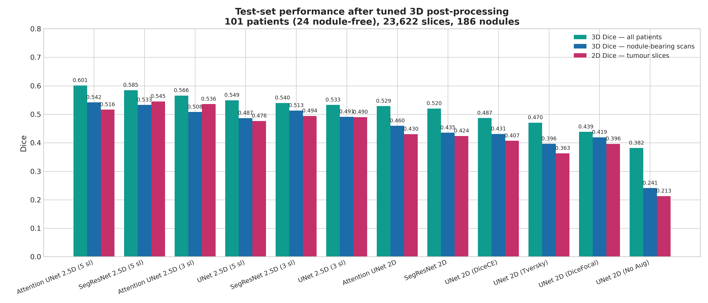
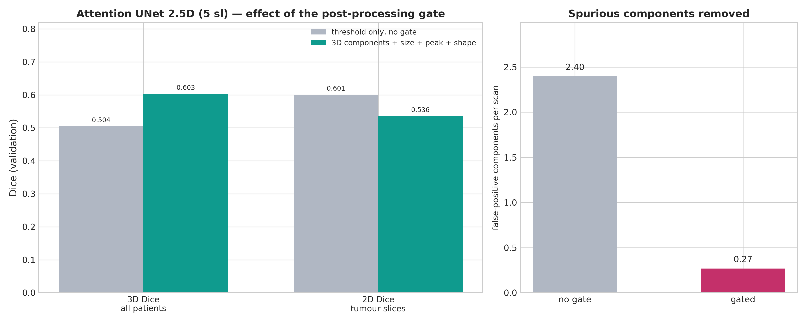

# Pulmonary Nodule Segmentation on LIDC-IDRI

[](https://www.python.org/downloads/release/python-3120/)
[](https://pytorch.org/)
[](https://monai.io/)

An end-to-end deep learning framework for **2D and 2.5D pulmonary nodule segmentation** on thoracic Computed Tomography (CT) scans from the **LIDC-IDRI** dataset. Built with PyTorch and MONAI, it covers DICOM preprocessing, majority-voting consensus annotation, class-balanced and size-aware slice sampling, mixed-precision training with weight averaging, a 3D component-level false-positive reduction stage tuned by a 43,200-configuration validation sweep, and a 4-level hierarchical evaluation suite comparing three architectures across loss functions, input slice windows, and augmentation regimes.

The optimisation target is **3D Dice over all test patients**, including the nodule-free ones. Every ranking in this document uses it.

---

## 1. Dataset — The LIDC-IDRI

The **Lung Image Database Consortium and Image Database Resource Initiative (LIDC-IDRI)** dataset consists of 1,018 thoracic CT scans collected across 8 medical institutions. Each scan contains uncompressed DICOM image slices paired with XML annotation markup files created by up to 4 experienced thoracic radiologists performing two-phase blind readings.

Our preprocessing pipeline processed **1,010 patients** (8 patients were omitted due to corrupt/incomplete DICOM headers or corrupted XML markup; e.g. `LIDC-IDRI-0238`, `LIDC-IDRI-0585`). Preprocessing produces two audit artifacts stored in `preprocessed_data/`:

### 1.1 Patient Series Audit (`patient_series_audit.csv`)
This file tracks per-patient metadata across 1,010 patient scan records:
- **Slice counts & Voxel Spacing:** Native slice counts range from 65 to 764 per CT volume. In-plane resolution varies from 0.461mm to 0.977mm, and slice thickness spans 0.6mm to 5.0mm (e.g., `2.500mm x 0.703mm x 0.703mm`).
- **Annotation Consensus:** Captures nodule counts grouped by radiologist agreement (nodules marked by 1, 2, 3, or 4 radiologists).
- **Volumetric Audit:** Records exact 3D nodule volumes in mm³, XML parsing integrity (`OK`), series completeness (`OK`), and radiologist malignancy ratings (1 to 5 scale).

### 1.2 Dataset Master Manifest (`dataset_manifest.csv`)
The master manifest indexes all **240,242 resampled 2D slices** across 1,010 patients, serving as the ground-truth database for PyTorch DataLoader creation.

| Dataset Parameter | Metric Count / Value |
|---|---|
| **Total Slices** | 240,242 2D slices |
| **Unique Patient Scans** | 1,010 CT volumes |
| **Training Split** | 193,496 slices (80.5%) |
| **Validation Split** | 23,124 slices (9.6%) |
| **Test Split** | 23,622 slices (9.8%) |
| **Class Distribution (Slices)** | **225,690 Negative Slices (93.94%)** vs. **14,552 Positive Slices (6.06%)** |
| **Inter-Annotator Agreement** | Pairwise radiologist agreement: **Mean 0.640**, **Median 0.676** (Std: 0.256) (`inter_annotator_dice`) |
| **Volume Preservation QA** | Voxel volume before/after resampling: `v_orig_mm3`, `v_resamp_mm3`, `v_retention_ratio` (~0.997), `recon_dice` (~0.936) |

> [!NOTE]
> **Inter-Annotator Agreement Benchmark:**
> Individual radiologist annotations show a mean pairwise inter-annotator Dice of **0.640** (median **0.676**, std **0.256**). Models are evaluated against the 50% majority consensus mask, which is a smoother and more centred target than any single reading. Per-nodule Dice for the leading configurations sits in the same range as this human agreement figure, so per-lesion segmentation quality is close to the intrinsic annotation noise ceiling. The remaining headroom is in **detection and false-positive suppression**, not boundary precision — which is why the headline metric charges for false alarms on healthy scans.

---

## 2. Preprocessing Pipeline

Data preparation is implemented in `preprocess/preprocess_dataset.py`, parallelized across multi-core CPUs via `ProcessPoolExecutor`:

```
Raw DICOM CT + XML Annotations 
   │
   ▼
1. XML Indexing ──────────► Parse Study/Series/SOP UIDs from XML files
   │
   ▼
2. DICOM Loading ─────────► Select largest CT series, apply Slope/Intercept (HU)
   │
   ▼
3. HU Normalization ──────► Clip [-1000, +400] HU → Rescale linearly to [0.0, 1.0]
   │
   ▼
4. Isotropic Resampling ──► Resample volume to uniform (1.0mm x 1.0mm x 1.0mm) voxels
   │
   ▼
5. Lung Extraction ──────► 2-pass lung field extraction & unified bounding box cropping (256x256)
   │
   ▼
6. Contour Rasterization ─► Match SOP UIDs to radiologist XML polygons → Binary nodule masks
   │
   ▼
7. Majority Voting ──────► Apply strict 50% consensus threshold (ceil(N * 0.5) agreement)
   │
   ▼
8. Export NPZ & Manifest ──► Save Float32 NPZ slices, dataset_manifest.csv and
                             slice_nodule_size.csv
```

Preprocessing also labels the consensus mask in 3D and records, for every slice, the volume
of the nodule that slice belongs to. That table (`slice_nodule_size.csv`) is what size-aware
sampling reads during training: a slice's own tumour pixel count cannot distinguish a
genuinely small nodule from the end cap of a large one.

### Preprocessing Configuration Parameters (`preprocess/preprocess_dataset.py`)
- `--dataset_dir`: Path to root directory containing DICOM folders and XML annotations.
- `--output_dir`: Target directory for saved `.npz` files and manifest files (default: `preprocessed_data`).
- `--num_workers`: Number of parallel CPU processes (default: `6`).
- `--consensus_ratio`: Minimum fraction of radiologist consensus required for a positive mask pixel (default: `0.5`, 50% majority vote).
- `--target_spacing`: Voxel resolution target (default: `1.0 1.0 1.0` mm isotropic).

### 2.1 uint8 Memmap Store (`preprocess/build_store.py`)

The `.npz` slices are zlib-compressed and carry per-annotator `session_masks` that training
never reads, so decoding them dominates the data path. `build_store.py` repacks them once
into fixed-shape arrays the DataLoader memory-maps directly:

```
<pid>_img.npy   uint8   (Z, 256, 256)   bilinear-resized, x255
<pid>_msk.npy   uint8   (Z * 8192,)     packbits of the (Z,256,256) bool mask
store_index.csv                         pid, n_slices, cs_h, cs_w, split
```

Images are HU-windowed and normalised to [0,1] before quantisation, so one uint8 step is
well below CT reconstruction noise. Training uses the store when present and falls back to
the `.npz` files automatically (`--no_store` forces the fallback).

```bash
python preprocess/build_store.py --splits train val test --workers 6
```

---

## 3. Training Pipeline

`training/train.py` trains 2D single-slice models; `training/train_2_5d.py` trains 2.5D
models that stack N adjacent slices as input channels. The two files are deliberately kept
near-identical so the only difference in a comparison is the slice window.

```
                     ┌───────────────────────────┐
                     │   2D Input (1x256x256)    │
                     └─────────────┬─────────────┘
                                   │
┌─────────────────────────┐        │        ┌─────────────────────────┐
│  NegRatioSampler        ├────────┼───────►│  PyTorch DataLoaders    │
│  neg_ratio + size_alpha │        │        │  (Batch Size: 64)       │
└─────────────────────────┘        │        └─────────────┬───────────┘
                                   │                      │
                     ┌─────────────┴─────────────┐        │
                     │  2.5D Input (Nx256x256)   │        │
                     │  N adjacent CT slices     │        │
                     └───────────────────────────┘        │
                                                          ▼
                                            ┌───────────────────────────┐
                                            │ AMP (fp16 / bf16 / fp32)  │
                                            │ AdamW  lr 1e-3, wd 1e-4   │
                                            │ warmup → cosine anneal    │
                                            │ EMA of weights (0.999)    │
                                            └─────────────┬─────────────┘
                                                          │
                                                          ▼
                                            ┌───────────────────────────┐
                                            │ Loss Functions:           │
                                            │ - DiceFocalLoss           │
                                            │ - DiceCELoss              │
                                            │ - TverskyFocalLoss        │
                                            └─────────────┬─────────────┘
                                                          │
                                                          ▼
                                            ┌───────────────────────────┐
                                            │ Validation: 3D rebuild,   │
                                            │ gate grid swept, best     │
                                            │ configuration reported    │
                                            └───────────────────────────┘
```

### 3.1 Supported Model Architectures
1. **UNet (`unet`)**: MONAI UNet with feature channels `(16, 32, 64, 128, 256)`, strides `(2, 2, 2, 2)`, `num_res_units=2`.
2. **Attention UNet (`attention_unet`)**: MONAI AttentionUnet, attention gating on the skip connections to suppress non-salient background, same channel layout.
3. **SegResNet (`segresnet`)**: MONAI SegResNet encoder-decoder with residual blocks (`init_filters=16`, `blocks_down=(1,2,2,4)`).

### 3.2 Loss Function Formulations
- **`dice_focal`** (default): `DiceFocalLoss(sigmoid=True, squared_pred=True, gamma=2.0)`. Blends Dice overlap with Focal Loss so gradients concentrate on hard boundary pixels.
- **`dice_ce`**: `DiceCELoss(sigmoid=True, squared_pred=True)`. Soft Dice plus binary cross-entropy.
- **`tversky` / `focal_tversky`**: `TverskyFocalLoss` ($\alpha=0.3, \beta=0.7, \gamma=2.0$). The higher $\beta$ penalises false negatives to favour recall; the focal exponent keeps gradients large on small lesions.

All three take `--dice_smooth`, which sets both `smooth_nr` and `smooth_dr` and matters more
than a smoothing constant usually would, because roughly 60% of sampled slices have an
**empty** mask. For an empty target the squared-pred Dice term reduces to
$1 - s/(\sum p^2 + s)$, so $s$ alone decides where the loss starts responding. At a very
small $s$ the loss is pinned near 1.0 with a numerically negligible gradient until every
pixel is driven to a strongly negative logit — a wide dead zone followed by a cliff. The
default of `1.0` places the gradient peak around a single confident false pixel, and leaves
positive samples unaffected.

> [!NOTE]
> Loss **values** are not comparable across different `--dice_smooth` settings. The same
> model can report very different losses under two settings.

### 3.3 Sampling

`NegRatioSampler` rebuilds the epoch's index each epoch:

- **`--neg_ratio`** fixes how many nodule-free slices accompany each positive one, so an
  epoch is not 94% background.
- **`--size_alpha` / `--size_cap`** repeat positive slices by
  `clip((median_vox / nodule_vox)**alpha, 1, size_cap)`. A nodule contributes one sample per
  slice it spans, so large lesions dominate the positive pool by default; this raises the
  small-nodule share at the cost of a proportionally larger epoch. It reads
  `slice_nodule_size.csv` and is disabled at `0`.

### 3.4 Optimisation

- **AdamW**, `lr 1e-3`, `weight_decay 1e-4`, gradient-norm clipping at 1.0.
- **Schedule**: linear warmup over `--warmup_epochs`, then cosine annealing to `--min_lr`.
- **EMA**: an exponential moving average of the weights is validated and checkpointed
  instead of the live model. The decay ramps in as `min(decay, (1+n)/(warmup+n))` so the
  random initialisation does not dominate the average during the first epochs.
- **`--amp_dtype`**: `fp16` (default, with GradScaler), `bf16` or `fp32`. fp16 has a narrow
  range; an architecture whose activations grow large can overflow to Inf, which
  normalisation then turns into NaN. Every such batch is skipped, and a fully skipped epoch
  now raises rather than reporting a loss of 0. `bf16` has fp32's exponent range and cannot
  overflow.
- **`--pos_weight`**: replaces the loss with Dice + BCE weighting the positive class. It is
  a rescue for a run that has collapsed to predicting nothing, where the gradient is
  destroyed by BCE's mean over every voxel when almost none are foreground — something
  `--dice_smooth` cannot fix. Off by default.

### 3.5 Validation and Checkpoint Selection

Validation reassembles each patient's full 3D volume and scores it with the same
post-processing module the evaluator uses. Rather than applying one fixed gate, it **sweeps
the gate grid every epoch** at a fixed probability threshold and reports the best
configuration, which is also the checkpoint-selection criterion.

This matters because the optimum is strongly model-dependent: a model whose probabilities
are calibrated rather than saturated may have no component reaching a high peak threshold at
all, in which case a fixed gate deletes every prediction, every epoch scores identically,
and the "best" checkpoint is whichever epoch happened to come first. Labelling the connected
components depends only on the threshold, so once they exist each gate combination is
arithmetic over per-component attributes and the whole grid costs about one extra labelling
pass.

The per-epoch log records the winning configuration in a `Gate` column:

```
Epoch | Loss | 3DAll | 3DNod | 3DRaw | CleanOK | 2DAll | 2DTumor | FA | FPcomp | Detect | Precision | Sensitivity | FailRate | Gate
```

### 3.6 Complete Training CLI Parameters

| Parameter | Command Argument | Default Value | Description |
|---|---|---|---|
| **Manifest Path** | `--manifest` | `preprocessed_data/dataset_manifest.csv` | Path to master dataset manifest CSV |
| **Epochs** | `--epochs` | `40` | Total training iterations |
| **Batch Size** | `--batch_size` | `64` | Training batch size |
| **Learning Rate** | `--lr` | `1e-3` | Peak learning rate after warmup |
| **Min LR** | `--min_lr` | `1e-5` | Cosine annealing floor |
| **Weight Decay** | `--weight_decay` | `1e-4` | AdamW decoupled weight decay |
| **Warmup Epochs** | `--warmup_epochs` | `3` | Linear LR warmup before annealing |
| **Negative Ratio** | `--neg_ratio` | `1.5` | Nodule-free slices sampled per positive slice |
| **Size Alpha** | `--size_alpha` | `0.0` | Repeat exponent for small-nodule slices; `0` disables |
| **Size Cap** | `--size_cap` | `4.0` | Maximum repeat factor for `--size_alpha` |
| **Nodule Sizes** | `--nodule_sizes` | `preprocessed_data/slice_nodule_size.csv` | Per-slice nodule volume table |
| **Input Slices** | `--in_slices` | `3` | Adjacent Z slices as channels (2.5D only; must be odd) |
| **Loss Selection** | `--loss` | `dice_focal` | `dice_focal`, `dice_ce`, `tversky`, `focal_tversky` |
| **Dice Smoothing** | `--dice_smooth` | `1.0` | `smooth_nr` and `smooth_dr` for the Dice term |
| **Positive Weight** | `--pos_weight` | `0.0` | Dice + pos-weighted BCE override; `0` disables |
| **Model Selection** | `--model_type` | `unet` | `unet`, `attention_unet`, `segresnet` |
| **AMP Precision** | `--amp_dtype` | `fp16` | `fp16`, `bf16`, `fp32` |
| **EMA Decay** | `--ema_decay` | `0.999` | Weight EMA decay; `0` disables |
| **EMA Warmup** | `--ema_warmup` | `10.0` | Steps over which the EMA decay ramps in |
| **Store Directory** | `--store_dir` | `preprocessed_data_u8` | uint8 memmap store; falls back to npz if absent |
| **No Store** | `--no_store` | `False` | Force the npz path |
| **Val Threshold** | `--val_threshold` | `0.5` | Probability threshold for the validation gate sweep |
| **No Transforms** | `--no_transforms` | `False` | Disable data augmentation |
| **Checkpoint Path** | `--save_path` | `models/unet_2.5d/unet_2.5d.pth` | Save location (directory or file) |
| **Resume Training** | `--resume` | `False` | Resume from `latest_checkpoint.pth` |
| **Random Seed** | `--seed` | `42` | Seed for sampling and initialisation |
| **Num Workers** | `--num_workers` | `8` | DataLoader worker processes |

Checkpoints written per run:

| File | Contents |
|---|---|
| `<model>_2.5d.pth` / `<model>_2d.pth` | best epoch by validation 3D Dice (EMA weights) |
| `last.pth` | final epoch, EMA weights |
| `latest_checkpoint.pth` | resume anchor: raw model, EMA, optimizer, scheduler, scaler |
| `train.txt` | per-epoch metric table |
| `training_history.png` | loss and metric curves |

---

## 4. Evaluation Pipeline & Post-Processing

Evaluation is run by `evaluation/evaluate.py` (2D models) and `evaluation/evaluate_2_5d.py` (2.5D models), producing a text report plus a per-patient CSV breakdown.

### 4.1 The Headline Metric

The primary metric is **3D Dice averaged over all test patients**, computed on the
reconstructed patient volume:

$$\text{Dice}_{\text{3D,all}} \;=\; \frac{1}{N}\sum_{i=1}^{N}
\begin{cases}
1.0 & \text{if the scan has no nodule and the prediction is empty}\\
0.0 & \text{if the scan has no nodule and anything is predicted}\\
\dfrac{2\,|P_i \cap G_i|}{|P_i| + |G_i|} & \text{otherwise}
\end{cases}$$

**24 of the 101 test patients are nodule-free.** For those, the score is all-or-nothing:
a single surviving false-positive component takes the patient from 1.0 to 0.0, which costs
$1/101 = 0.0099$ — the same as taking a cancer patient from a perfect segmentation to
nothing at all. A predictor that outputs nothing everywhere scores $24/101 = 0.2376$, which
is the floor any real model must clear.

Supporting metrics, all reported alongside it:

| Metric | Averaged over | Measures |
|---|---|---|
| **3D Dice — all patients** | all 101 test patients | the system as a whole; the optimisation target |
| **3D Dice — nodule scans** | the 77 patients with a nodule | volumetric quality, blind to false alarms on healthy scans |
| **3D Dice — per nodule** | the 186 individual lesions | segmentation quality given a correct detection |
| **2D Dice — tumour slices** | the 1,395 slices containing a nodule | per-slice segmentation quality |
| **2D Dice — all slices** | all 23,622 test slices | dominated by empty slices; retained for continuity |

> [!WARNING]
> **2D all-slice Dice is easy to game.** 94% of test slices contain no tumour, and an empty
> prediction on an empty ground truth scores 1.0, so a model that predicts almost nothing
> scores highly. It is reported for completeness but is never used for ranking or selection.

### 4.2 Post-Processing Pipeline

Predictions are reassembled into the full 3D patient volume before any filtering, so that
detection is separated from segmentation:

```
probability volume (per patient)
   │
   ▼
1. Pixel threshold ─────────► SEGMENTATION decision: how tightly the mask
   (--threshold)              hugs each lesion boundary
   │
   ▼
2. 3D connected components ─► 26-connectivity labelling on the reconstructed
   + min volume               volume; the 2D filter had no context along Z
   (--min_voxels_3d)
   │
   ▼
3. Peak-probability gate ───► DETECTION decision: keep a component only if its
   (--min_peak_prob)          MAXIMUM probability clears the gate. Low-confidence
   │                          blobs are deleted whole, never eroded.
   ▼
4. Shape gate ──────────────► drop components whose sqrt(λ1/λ3) exceeds a cut.
   (--max_elongation)         Vessels are tubular; nodules are compact (≈1).
   │
   ▼
   final mask         (+ optional --tta: sigmoid averaged over 4 flips)
```

**Why stages 1 and 3 must be separate.** A single threshold doing both jobs trades tumour
Dice away point-for-point: raising it to suppress false blobs also erodes every real
boundary. Binarising *low* and gating whole components on confidence breaks that trade-off.
Stage 3 is exactly 3D hysteresis thresholding — "the component contains a voxel above
$t_{high}$" is identical to "$\max(\text{component}) \ge t_{high}$".

Stage 3 is also the only stage that can empty a scan outright, which makes it the dominant
knob for the headline metric. Its best value is strongly model-dependent, so it is swept
rather than assumed — see §5.1. The same module (`evaluation/postprocess.py`) is imported by
the trainer, the evaluators and the visualizers, so the gate applied during training is
byte-identical to the one that produces the reported numbers.

### 4.3 Evaluation CLI Parameters

| Parameter | Default | Description |
|---|---|---|
| `--model_path` | — | Path to the trained `.pth` checkpoint |
| `--split` | `test` | Dataset split (`train`, `val`, `test`) |
| `--threshold` | `0.5` | Probability threshold for binarisation |
| `--min_voxels_3d` | `15` | Minimum 3D connected-component volume, in voxels |
| `--min_peak_prob` | `0.0` (off) | Keep a component only if its peak probability reaches this |
| `--max_elongation` | `0.0` (off) | Drop components more elongated than this |
| `--tta` | `0` | `1` = average the sigmoid over 4 horizontal/vertical flips |
| `--report_path` | `<model_dir>/test_evaluation_report.txt` | Output report path |
| `--in_slices` | read from checkpoint | 2.5D evaluator matches the checkpoint's slice window automatically |
| `--batch_size` / `--num_workers` / `--seed` | `32` / `8` / `42` | Standard |

### 4.4 Hierarchical Evaluation Framework

1. **Per-slice 2D** — tumour slices and all slices, with Dice, IoU, Precision, Sensitivity, Specificity, HD95, ASD, failure rate and false-alarm rate.
2. **Per-patient 3D** — slices stacked into the patient volume, volumetric Dice and surface
   distances, reported both over **all** patients and over nodule-bearing scans only.
3. **Per-nodule 3D** — connected-component lesion analysis, stratified into Small (<100 voxels), Medium (100–1000) and Large (≥1000).
4. **Per-patient CSV** — `patient_evaluation_breakdown.csv`.

> [!NOTE]
> Per-nodule metrics are computed inside each lesion's bounding box, so they measure segmentation quality **given** a correct detection. They are not detection results.

---

## 5. Experimental Results

All post-processing parameters were selected on the **validation split**. The test split
was used exactly once per model, after the parameters were fixed. Every table is ordered
by 3D Dice over all test patients.

### 5.1 Operating Point Selection (Validation Split)

A grid of **43,200 configurations** — 6 probability thresholds × 10 minimum volumes ×
10 peak gates × 6 elongation cuts, for each of the 12 models — was swept on the validation
split (101 patients, 23,124 slices). The full grid is committed at
[`new_model_evals/val_operating_point_grid.csv`](new_model_evals/val_operating_point_grid.csv).

Each model's operating point maximises **validation 3D Dice over all patients**, the same
quantity the test tables report. No constraint or tumour-Dice floor is applied: because the
metric already charges 1.0 per patient for a false alarm on a healthy scan, it penalises
over-filtering and under-filtering on its own.

| Model | threshold | min voxels | peak gate | max elongation |
|---|---|---|---|---|
| Attention UNet 2.5D (5 sl) | 0.5 | 35 | 0.998 | 2 |
| SegResNet 2.5D (5 sl) | 0.4 | 35 | 0.995 | 2 |
| Attention UNet 2.5D (3 sl) | 0.3 | 35 | 0.99 | 2.5 |
| UNet 2.5D (5 sl) | 0.3 | 35 | off | 2 |
| SegResNet 2.5D (3 sl) | 0.6 | 25 | 0.9999 | 2 |
| UNet 2.5D (3 sl) | 0.5 | 35 | off | 2.5 |
| Attention UNet 2D | 0.3 | 0 | 0.995 | 3 |
| SegResNet 2D | 0.7 | 50 | 0.998 | 2.5 |
| UNet 2D (DiceCE) | 0.4 | 35 | off | 3 |
| UNet 2D (TverskyFocal) | 0.3 | 50 | 0.9999 | 2.5 |
| UNet 2D (DiceFocal) | 0.5 | 15 | off | 4 |
| UNet 2D (No Aug) | 0.3 | 0 | 0.99 | 2.5 |

Chosen points are committed at
[`new_model_evals/selected_operating_points.csv`](new_model_evals/selected_operating_points.csv).

> [!NOTE]
> The peak gate lands anywhere from `off` to `0.9999` depending on the model. A network
> whose probabilities saturate needs a very high cut to discriminate at all, while one
> that stays calibrated has no component near 0.999 and would be erased by that value.
> This is why the gate is swept per model rather than fixed.

---

### 5.2 Test Set Results

Held-out test split: **101 patients (24 nodule-free), 23,622 slices (1,395 tumour-positive),
186 distinct 3D nodules.** Each model evaluated once, at its validation-selected operating
point, with 4-flip TTA.

| Model | Input | 3D Dice (all patients) | 3D Dice (nodule scans) | 3D Dice (per nodule) | 2D Dice (tumour) | Sensitivity | Nodule failure |
|---|---|---|---|---|---|---|---|
| **Attention UNet 2.5D (5 sl)** | 5 sl | **0.6012** | 0.5419 | 0.4827 | 0.5165 | 0.5526 | 40.3% |
| SegResNet 2.5D (5 sl) | 5 sl | 0.5846 | 0.5330 | 0.5441 | 0.5451 | 0.6123 | 32.3% |
| Attention UNet 2.5D (3 sl) | 3 sl | 0.5656 | 0.5081 | 0.5276 | 0.5360 | 0.6090 | 34.9% |
| UNet 2.5D (5 sl) | 5 sl | 0.5493 | 0.4867 | 0.4773 | 0.4764 | 0.5564 | 39.2% |
| SegResNet 2.5D (3 sl) | 3 sl | 0.5397 | 0.5131 | 0.5085 | 0.4942 | 0.5950 | 36.0% |
| UNet 2.5D (3 sl) | 3 sl | 0.5330 | 0.4914 | 0.4673 | 0.4900 | 0.4967 | 38.2% |
| Attention UNet 2D | 2D | 0.5287 | 0.4597 | 0.4283 | 0.4305 | 0.5086 | 44.6% |
| SegResNet 2D | 2D | 0.5201 | 0.4355 | 0.3725 | 0.4238 | 0.4681 | 51.6% |
| UNet 2D (DiceCE) | 2D | 0.4869 | 0.4309 | 0.3775 | 0.4072 | 0.4319 | 48.9% |
| UNet 2D (TverskyFocal) | 2D | 0.4705 | 0.3964 | 0.3320 | 0.3631 | 0.4049 | 56.5% |
| UNet 2D (DiceFocal) | 2D | 0.4385 | 0.4193 | 0.3950 | 0.3961 | 0.4193 | 43.5% |
| UNet 2D (No Aug) | 2D | 0.3818 | 0.2411 | 0.1744 | 0.2129 | 0.2443 | 76.9% |



An empty predictor scores **0.2376** on the headline metric, so that is the floor, not zero.

> [!NOTE]
> **SegResNet 2D and SegResNet 2.5D (3 slices)** were trained with `--pos_weight 1000`,
> which replaces the loss with Dice + positively-weighted BCE. Under the standard loss both
> runs collapsed to predicting nothing and could not recover; the positive weighting
> restores the gradient that the mean over overwhelmingly background voxels destroys. All
> other models in these tables use the standard loss configuration.

---

### 5.3 Effect of the Post-Processing Gate

The leading model on validation, with a probability threshold only versus the full gate:

| Metric (validation) | threshold only | full gate | Change |
|---|---|---|---|
| 3D Dice — all patients | 0.5045 | **0.6031** | **+0.0986** |
| 2D Dice — tumour slices | 0.6005 | 0.5357 | -0.0648 |
| False-positive components per scan | 2.40 | **0.27** | **-2.13** |
| Nodule detection rate | 84.6% | 61.7% | -22.9% |



The gate trades detection and a little boundary Dice for a large reduction in spurious
components. Under the headline metric that is a favourable exchange, because every
component surviving on a nodule-free scan costs a full patient.

---

### 5.4 Comparison: Loss Functions (UNet 2D)


| Loss | 3D Dice (all patients) | 3D Dice (per nodule) | 2D Dice (tumour) | Small-nodule Dice |
|---|---|---|---|---|
| DiceCE | 0.4869 | 0.3775 | 0.4072 | 0.2272 |
| TverskyFocal | 0.4705 | 0.3320 | 0.3631 | 0.1910 |
| DiceFocal | 0.4385 | 0.3950 | 0.3961 | 0.2704 |

On the headline metric DiceCE leads this group, while DiceFocal recovers more of the
smallest lesions. The three are close enough that the choice is not decisive on its own.

---

### 5.5 Comparison: Data Augmentation


| Metric | With augmentation | Without augmentation |
|---|---|---|
| 3D Dice — all patients | **0.4385** | 0.3818 |
| 3D Dice — per nodule | **0.3950** | 0.1744 |
| 2D Dice — tumour slices | **0.3961** | 0.2129 |
| Nodule failure rate | **43.5%** | 76.9% |
| 2D Dice — all slices | 0.9419 | *0.9485* |

Without augmentation the validation curve peaks at epoch 10 and decays — textbook
overfitting. It also illustrates why all-slice Dice is not used for ranking: the
un-augmented model scores **higher** on that column while missing most lesions.

---

### 5.6 Comparison: Input Slice Window


| Architecture | 2D (1 slice) | 2.5D (3 slices) | 2.5D (5 slices) | Best Δ over 2D |
|---|---|---|---|---|
| UNet | 0.4385 | 0.5330 | 0.5493 | **+0.1108** |
| Attention UNet | 0.5287 | 0.5656 | 0.6012 | **+0.0725** |
| SegResNet | 0.5201 | 0.5397 | 0.5846 | **+0.0645** |

Adjacent-slice context helps every architecture on the headline metric, and **all three peak
at 5 slices**. Where the gain arrives differs: UNet takes almost all of it in the first step
(+0.095 from 1 to 3 slices, +0.016 from 3 to 5), Attention UNet gains about equally at each
step (+0.037, +0.036), and SegResNet gains more from the second (+0.020, +0.045).

---

### 5.7 Comparison: Model Architecture

At 5 slices, **Attention UNet** leads on the headline metric
(0.6012) with **SegResNet** close behind
(0.5846); SegResNet is ahead on per-nodule Dice
(0.5441 vs 0.4827)
and notably better on small lesions. Attention UNet wins the all-patient metric by firing
less often on nodule-free scans, not by segmenting better.

---

### 5.8 Nodule Size Stratification


| Model | Small (<100 vox, n=93) | Medium (100–1000, n=75) | Large (≥1000, n=18) |
|---|---|---|---|
| Attention UNet 2.5D (5 sl) | 0.3800 | 0.5752 | 0.6281 |
| SegResNet 2.5D (5 sl) | 0.4562 | 0.6525 | 0.5461 |
| Attention UNet 2.5D (3 sl) | 0.4157 | 0.6376 | 0.6467 |
| UNet 2.5D (5 sl) | 0.3542 | 0.6188 | 0.5237 |
| SegResNet 2.5D (3 sl) | 0.4200 | 0.6237 | 0.4853 |
| UNet 2.5D (3 sl) | 0.3535 | 0.5616 | 0.6618 |

Small nodules remain the hardest category by a wide margin and hold the most headroom.
`--size_alpha` exists to address exactly this imbalance in the training sampler.

---

## 6. Installation & Reproduction

### 6.1 Prerequisites & Dependencies
- Linux OS / Windows
- Python 3.12+
- CUDA-capable GPU

Install project requirements:
```bash
pip install -r requirements.txt
```

#### `requirements.txt`
```text
torch
torchvision
torchaudio
monai>=1.3.0
numpy<2.0.0
pandas
matplotlib
scipy
tqdm
pydicom
opencv-python<5.0.0
```

---

### 6.2 Step-by-Step Execution Guide

#### Step 1: Dataset Preprocessing
Convert raw LIDC-IDRI DICOM files and XML annotations into isotropic `.npz` slices, the
manifest and the per-slice nodule volume table:
```bash
python preprocess/preprocess_dataset.py \
    --dataset_dir /path/to/LIDC-IDRI \
    --output_dir preprocessed_data \
    --num_workers 8 \
    --consensus_ratio 0.5
```

#### Step 2: Build the uint8 Store
Repack the `.npz` slices so training reads memory-mapped arrays instead of decoding
compressed archives:
```bash
python preprocess/build_store.py --splits train val test --workers 6
```

#### Step 3: Model Training
Train the leading configuration, Attention UNet 2.5D with a 5-slice window:
```bash
python training/train_2_5d.py \
    --model_type attention_unet \
    --in_slices 5 \
    --loss dice_focal \
    --dice_smooth 1.0 \
    --size_alpha 0.5 --size_cap 4 \
    --neg_ratio 1.5 \
    --warmup_epochs 3 \
    --epochs 60 \
    --batch_size 64 \
    --save_path models/attention_unet_2_5d_5sl/
```

Train a 2D baseline (no `--in_slices`; `training/train.py` has no slice window):
```bash
python training/train.py \
    --model_type unet \
    --loss tversky \
    --epochs 60 \
    --batch_size 64 \
    --save_path models/unet_2d_tversky/
```

If a run collapses to predicting nothing and does not recover, rescue it with a positively
weighted loss, and use `bf16` for architectures whose activations overflow fp16:
```bash
python training/train_2_5d.py \
    --model_type segresnet --in_slices 3 \
    --pos_weight 1000 --amp_dtype bf16 \
    --epochs 60 --save_path models/segresnet_2_5d/
```

#### Step 4: Model Evaluation on Test Split
Evaluate a checkpoint at its validation-selected operating point (see §5.1):
```bash
python evaluation/evaluate_2_5d.py \
    --model_path new_models/attention_unet_2_5d_5l/attention_unet_2.5d.pth \
    --split test \
    --threshold 0.5 \
    --min_voxels_3d 35 \
    --min_peak_prob 0.998 \
    --max_elongation 2.0 \
    --tta 1 \
    --report_path new_model_evals/attention_unet_2_5d_5l/test_report.txt
```

The evaluator reads the slice window from the checkpoint, so the same command works for 3-
and 5-slice models. Use `evaluation/evaluate.py` for 2D checkpoints.

---

## 7. Interactive Visualization Tools

Both interactive visualizers apply the **same four-stage post-processing pipeline as
`evaluation/`** (§4.2) — probability threshold, 3D component size, peak-probability
gate, and elongation shape filter — and support the same 4-flip test-time
augmentation. What the GUI draws is therefore what the reported metrics measure.

One difference is handled automatically. The evaluator gates on the 256×256 grid,
whereas the visualizers interpolate predictions back to the patient's native 1 mm
crop, where the same component contains more voxels. `--min_voxels_3d` is
therefore rescaled by the actual area ratio so the same value means the same physical
size in both tools; the adjustment is printed at startup:

```
min_voxels_3d 35 (256 grid) -> 74 on this patient's 369x375 native grid
```

Elongation needs no such correction — it is measured in millimetres, and the native
npz grid is 1 mm isotropic after preprocessing.

### 7.1 Interactive 2D Slice Visualizer (`visualization/visualize_patient_interactive.py`)
An interactive GUI for exploring 2D model predictions slice-by-slice alongside
ground-truth masks. Invoked here at Attention UNet 2D's tuned operating point (§5.1):
```bash
python visualization/visualize_patient_interactive.py \
    --model_path new_models/attention_unet_2d/attention_unet_2d.pth \
    --patient_id LIDC-IDRI-0002 \
    --threshold 0.3 \
    --min_voxels_3d 0 \
    --min_peak_prob 0.995 \
    --max_elongation 3.0 \
    --tta 1
```

### 7.2 Interactive 2.5D Slice Visualizer (`visualization/visualize_patient_interactive_2_5d.py`)
Interactive slice visualizer for multi-slice 2.5D predictions. The slice window is read
from the checkpoint, so the same command works for 3- and 5-slice models. Shown here at the
leading model's tuned operating point:
```bash
python visualization/visualize_patient_interactive_2_5d.py \
    --model_path new_models/attention_unet_2_5d_5l/attention_unet_2.5d.pth \
    --patient_id LIDC-IDRI-0002 \
    --threshold 0.5 \
    --min_voxels_3d 35 \
    --min_peak_prob 0.998 \
    --max_elongation 2.0 \
    --tta 1
```

The active filter chain is shown in the prediction panel title, e.g.
`≥35 voxels, peak ≥0.998, elong ≤2.0, 4-flip TTA`. Setting `--max_elongation 0`
disables the shape filter and `--tta 0` disables test-time augmentation, which is
useful for seeing what each stage removes.

### 7.3 Dataset Analytics Visualizer (`visualization/visualize_dataset.py`)
Generates exploratory dataset distribution plots for slice thickness, HU histograms, and nodule volume distributions:
```bash
python visualization/visualize_dataset.py
```
