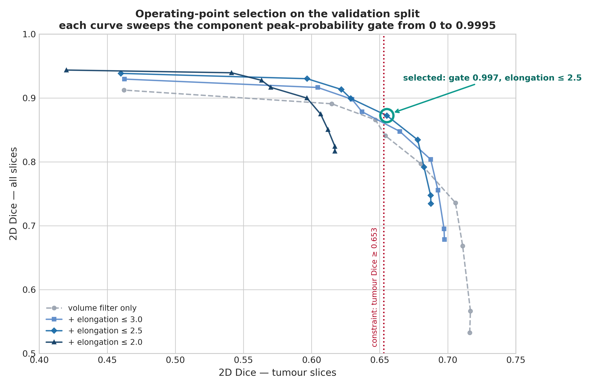

# Pulmonary Nodule Segmentation on LIDC-IDRI

[](https://www.python.org/downloads/release/python-3120/)
[](https://pytorch.org/)
[](https://monai.io/)

An end-to-end, high-performance deep learning framework for **2D and 2.5D pulmonary nodule segmentation** on thoracic Computed Tomography (CT) scans from the **LIDC-IDRI** dataset. Built with PyTorch and MONAI, this project implements DICOM preprocessing, majority-voting consensus annotation, dynamic negative slice sampling, mixed-precision training, a 3D component-level false-positive reduction stage tuned by a 4,860-configuration validation sweep, and a 4-level hierarchical evaluation suite comparing multiple deep neural architectures across varied loss functions, spatial context representations, and data augmentation regimes.

---

## 1. Dataset — The LIDC-IDRI

The **Lung Image Database Consortium and Image Database Resource Initiative (LIDC-IDRI)** dataset consists of 1,018 thoracic CT scans collected across 8 medical institutions. Each scan contains uncompressed DICOM image slices paired with XML annotation markup files created by up to 4 experienced thoracic radiologists performing two-phase blind readings.

Our preprocessing pipeline processed **1,010 patients** (8 patients were omitted due to corrupt/incomplete DICOM headers or corrupted XML markup; e.g. `LIDC-IDRI-0238`, `LIDC-IDRI-0585`). Preprocessing produces two audit artifacts stored in `preprocessed_data/`:

### 1.1 Patient Series Audit (`patient_series_audit.csv`)
This file tracks per-patient metadata across 1,010 patient scan records:
- **Slice counts & Voxel Spacing:** Native slice counts range from 65 to 764 per CT volume. In-plane resolution varies from 0.461mm to 0.977mm, and slice thickness spans 0.6mm to 5.0mm (e.g., `2.500mm x 0.703mm x 0.703mm`).
- **Annotation Consensus:** Captures nodule counts grouped by radiologist agreement (nodules marked by 1, 2, 3, or 4 radiologists).
- **Volumetric Audit:** Records exact 3D nodule volumes in mm³, XML parsing integrity (`OK`), series completeness (`OK`), and radiologist malignancy ratings (1 to 5 scale).

### 1.2 Dataset Master Manifest (`dataset_manifest.csv`)
The master manifest indexes all **240,242 resampled 2D slices** across 1,010 patients, serving as the ground-truth database for PyTorch DataLoader creation.

| Dataset Parameter | Metric Count / Value |
|---|---|
| **Total Slices** | 240,242 2D slices |
| **Unique Patient Scans** | 1,010 CT volumes |
| **Training Split** | 193,496 slices (80.5%) |
| **Validation Split** | 23,124 slices (9.6%) |
| **Test Split** | 23,622 slices (9.8%) |
| **Class Distribution (Slices)** | **225,690 Negative Slices (93.94%)** vs. **14,552 Positive Slices (6.06%)** |
| **Inter-Annotator Agreement** | Pairwise radiologist agreement: **Mean ~0.590**, **Median ~0.642** (Std: 0.227) (`inter_annotator_dice`) |
| **Volume Preservation QA** | Voxel volume before/after resampling: `v_orig_mm3`, `v_resamp_mm3`, `v_retention_ratio` (~0.997), `recon_dice` (~0.936) |

> [!NOTE]
> **Inter-Annotator Agreement Benchmark:**
> Individual radiologist annotations across the LIDC-IDRI dataset show a mean pairwise inter-annotator Dice agreement of **0.5896** (median **0.6421**, std **0.2272**). Models are evaluated against the 50% majority consensus mask (which provides a smoother, more centered ground truth). The top-performing configuration (Attention UNet 2.5D: 0.6104 2D tumour Dice, 0.5928 3D per-nodule Dice at the operating point selected in §5.1) sits close to the intrinsic noise ceiling of expert human variability. Raising the operating point toward maximum tumour Dice reaches 0.7256 on validation, at the cost of far more false positives — see §5.1.

---

## 2. Preprocessing Pipeline

Data preparation is implemented in `preprocess/preprocess_dataset.py`, parallelized across multi-core CPUs via `ProcessPoolExecutor`:

```
Raw DICOM CT + XML Annotations 
   │
   ▼
1. XML Indexing ──────────► Parse Study/Series/SOP UIDs from XML files
   │
   ▼
2. DICOM Loading ─────────► Select largest CT series, apply Slope/Intercept (HU)
   │
   ▼
3. HU Normalization ──────► Clip [-1000, +400] HU → Rescale linearly to [0.0, 1.0]
   │
   ▼
4. Isotropic Resampling ──► Resample volume to uniform (1.0mm x 1.0mm x 1.0mm) voxels
   │
   ▼
5. Lung Extraction ──────► 2-pass lung field extraction & unified bounding box cropping (256x256)
   │
   ▼
6. Contour Rasterization ─► Match SOP UIDs to radiologist XML polygons → Binary nodule masks
   │
   ▼
7. Majority Voting ──────► Apply strict 50% consensus threshold (ceil(N * 0.5) agreement)
   │
   ▼
8. Export NPZ & Manifest ──► Save Float32 NPZ slices & dataset_manifest.csv
```

### Preprocessing Configuration Parameters (`preprocess/preprocess_dataset.py`)
- `--dataset_dir`: Path to root directory containing DICOM folders and XML annotations.
- `--output_dir`: Target directory for saved `.npz` files and manifest files (default: `preprocessed_data`).
- `--num_workers`: Number of parallel CPU processes (default: `6`).
- `--consensus_ratio`: Minimum fraction of radiologist consensus required for a positive mask pixel (default: `0.5`, 50% majority vote).
- `--target_spacing`: Voxel resolution target (default: `1.0 1.0 1.0` mm isotropic).

---

## 3. Training Pipeline

Training is performed using `training/train.py` for 2D single-slice models and `training/train_2_5d.py` for 2.5D multi-slice models.

```
                     ┌───────────────────────────┐
                     │   2D Input (1x256x256)    │
                     └─────────────┬─────────────┘
                                   │
┌─────────────────────────┐        │        ┌─────────────────────────┐
│ Dynamic Class Resample  ├────────┼───────►│  PyTorch DataLoaders    │
│ (neg_ratio = 1.5)       │        │        │  (Batch Size: 64)       │
└─────────────────────────┘        │        └─────────────┬───────────┘
                                   │                      │
                     ┌─────────────┴─────────────┐        │
                     │  2.5D Input (3x256x256)   │        │
                     │ (prev, current, next CT)  │        │
                     └───────────────────────────┘        │
                                                          ▼
                                            ┌───────────────────────────┐
                                            │ AMP FP16 Mixed Precision  │
                                            │ AdamW (lr=1e-3, decay=1e-4)│
                                            └─────────────┬─────────────┘
                                                          │
                                                          ▼
                                            ┌───────────────────────────┐
                                            │ Loss Functions:           │
                                            │ - DiceFocalLoss           │
                                            │ - DiceCELoss              │
                                            │ - TverskyFocalLoss        │
                                            └───────────────────────────┘
```

### 3.1 Supported Model Architectures
1. **UNet (`unet`)**: MONAI UNet architecture with feature channels `(16, 32, 64, 128, 256)`, down/upsampling strides `(2, 2, 2, 2)`, and `num_res_units=2`.
2. **Attention UNet (`attention_unet`)**: MONAI AttentionUnet integrating attention gating mechanisms at skip connections with feature channels `(16, 32, 64, 128, 256)` to suppress non-salient background noise.
3. **SegResNet (`segresnet`)**: MONAI SegResNet encoder-decoder network featuring residual blocks (`init_filters=16`, `blocks_down=(1,2,2,4)`).

### 3.2 Loss Function Formulations
- **`dice_focal`** (Default): `DiceFocalLoss(sigmoid=True, squared_pred=True, gamma=2.0)`. Blends Dice overlap optimization with Focal Loss to focus gradients on hard-to-classify boundary pixels.
- **`dice_ce`**: `DiceCELoss(sigmoid=True, squared_pred=True)`. Combines soft Dice loss with Binary Cross-Entropy.
- **`tversky` / `focal_tversky`**: `TverskyFocalLoss` ($\alpha=0.3, \beta=0.7, \gamma=2.0$). Implements Focal Tversky Loss. Higher $\beta=0.7$ penalizes false negatives (missed nodules) to boost recall, while the focal exponent $\gamma=2.0$ keeps gradients large for hard-to-segment small examples.

### 3.3 Complete Training CLI Parameters

| Parameter | Command Argument | Default Value | Description |
|---|---|---|---|
| **Manifest Path** | `--manifest` | `preprocessed_data/dataset_manifest.csv` | Path to master dataset manifest CSV |
| **Epochs** | `--epochs` | `40` | Total training iterations |
| **Batch Size** | `--batch_size` | `64` | Training batch size |
| **Learning Rate** | `--lr` | `1e-3` | Initial learning rate (CosineAnnealingLR) |
| **Min LR** | `--min_lr` | `1e-5` | Minimum learning rate bound |
| **Weight Decay** | `--weight_decay` | `1e-4` | AdamW L2 regularization coefficient |
| **Negative Ratio** | `--neg_ratio` | `1.5` | Ratio of sampled negative to positive slices per epoch |
| **Loss Selection** | `--loss` | `dice_focal` | Choice of `dice_focal`, `dice_ce`, `tversky` |
| **Model Selection** | `--model_type` | `unet` | Choice of `unet`, `attention_unet`, `segresnet` |
| **No Transforms** | `--no_transforms` | `False` | Flag to disable data augmentation |
| **Checkpoint Path**| `--save_path` | `models/unet/unet.pth` | Target model save location |
| **Resume Training**| `--resume` | `False` | Resume training from existing checkpoint |
| **Random Seed** | `--seed` | `42` | Global seed for full reproducible splits & initialization |
| **Num Workers** | `--num_workers` | `8` | DataLoader parallel worker processes |

---

## 4. Evaluation Pipeline & Post-Processing

Evaluation is run by `evaluation/evaluate.py` (2D models) and `evaluation/evaluate_2_5d.py` (2.5D models), producing a text report plus a per-patient CSV breakdown.

### 4.1 The Two Headline Metrics

Two Dice numbers are reported, and they answer different questions:

| Metric | Averaged over | Measures |
|---|---|---|
| **2D Dice — tumour slices** | the 1,395 test slices containing a nodule | segmentation quality |
| **2D Dice — all slices** | all 23,622 test slices (empty prediction on empty ground truth = 1.0) | the system as a whole |

The all-slice metric decomposes exactly:

$$\text{Dice}_{\text{all}} \;=\; 0.941 \times (1 - \text{FA}_{\text{neg}}) \;+\; 0.059 \times \text{Dice}_{\text{tumour}}$$

where $\text{FA}_{\text{neg}}$ is the fraction of tumour-free slices carrying at least one predicted pixel. **94% of the all-slice score is decided on slices that contain no tumour at all.** One point of false-alarm rate is therefore worth roughly *sixteen times* as much as one point of tumour Dice — which is why the post-processing stage below exists, and why it is allowed to trade a little tumour Dice away.

### 4.2 Post-Processing Pipeline

The earlier per-slice 2D blob filter has been removed. Predictions are now reassembled into the full 3D patient volume before any filtering, and detection is separated from segmentation:

```
probability volume (per patient)
   │
   ▼
1. Pixel threshold ─────────► SEGMENTATION decision: how tightly the mask
   (--threshold)              hugs each lesion boundary
   │
   ▼
2. 3D connected components ─► 26-connectivity labelling on the reconstructed
   + min volume               volume; the 2D filter had no context along Z
   (--min_voxels_3d)
   │
   ▼
3. Peak-probability gate ───► DETECTION decision: keep a component only if its
   (--min_peak_prob)          MAXIMUM probability clears the gate. Low-confidence
   │                          blobs are deleted whole, never eroded.
   ▼
4. Shape gate ──────────────► drop components whose sqrt(λ1/λ3) exceeds a cut.
   (--max_elongation)         Vessels are tubular; nodules are compact (≈1).
   │
   ▼
   final mask         (+ optional --tta: sigmoid averaged over 4 flips)
```

**Why stages 1 and 3 must be separate.** A single threshold doing both jobs trades tumour Dice away point-for-point: raising it to suppress false blobs also erodes every real boundary. Binarising *low* and gating whole components on confidence breaks that trade-off. Stage 3 is exactly 3D hysteresis thresholding — "the component contains a voxel above $t_{high}$" is identical to "$\max(\text{component}) \ge t_{high}$".

### 4.3 Evaluation CLI Parameters

| Parameter | Default | Description |
|---|---|---|
| `--model_path` | — | Path to the trained `.pth` checkpoint |
| `--split` | `test` | Dataset split (`train`, `val`, `test`) |
| `--threshold` | `0.5` | Probability threshold for binarisation |
| `--min_voxels_3d` | `15` | Minimum 3D connected-component volume, in voxels |
| `--min_peak_prob` | `0.0` (off) | Keep a component only if its peak probability reaches this |
| `--max_elongation` | `0.0` (off) | Drop components more elongated than this |
| `--tta` | `0` | `1` = average the sigmoid over 4 horizontal/vertical flips |
| `--report_path` | `<model_dir>/test_evaluation_report.txt` | Output report path |
| `--batch_size` / `--num_workers` / `--seed` | `32` / `8` / `42` | Standard |

### 4.4 Hierarchical Evaluation Framework

1. **Per-slice 2D** — tumour slices and all slices, with Dice, IoU, Precision, Sensitivity, Specificity, HD95, ASD, failure rate and false-alarm rate.
2. **Per-patient 3D** — slices stacked into the patient volume, volumetric Dice and surface distances.
3. **Per-nodule 3D** — connected-component lesion analysis, stratified into Small (<100 voxels), Medium (100–1000) and Large (≥1000).
4. **Per-patient CSV** — `patient_evaluation_breakdown.csv`.

> [!NOTE]
> Per-nodule metrics are computed inside each lesion's bounding box, so they measure segmentation quality **given** a correct detection. They are not detection results.

---

## 5. Experimental Results

All post-processing parameters were selected on the **validation split**. The test split was used exactly once per model, after the parameters were fixed.

### 5.1 Operating Point Selection (Validation Split)

A grid of **4,860 configurations** — pixel threshold × minimum volume × peak gate × elongation cut — was swept for all 9 models on the validation split (101 patients, 23,124 slices). The full grid is committed at [`model_evals/val_operating_point_grid.csv`](model_evals/val_operating_point_grid.csv).

The operating point for each model was chosen by a constrained rule:

> **Maximise 2D all-slice Dice, subject to 2D tumour-slice Dice remaining at least `0.90 ×` that model's own unfiltered tumour-Dice ceiling.**

The floor is *relative* because the models differ enormously in baseline quality — Attention UNet 2.5D reaches 0.726 unfiltered while UNet (No Aug) reaches only 0.376, so a single absolute floor would exclude the weaker models outright.



| Model | threshold | min voxels | peak gate | max elongation | Val all-Dice | Val tumour Dice |
|---|---|---|---|---|---|---|
| Attention UNet 2.5D | 0.5 | 35 | 0.997 | 2.5 | 0.8723 | 0.6553 |
| SegResNet 2.5D | 0.4 | 35 | 0.990 | 2.5 | 0.8804 | 0.6327 |
| UNet 2.5D | 0.4 | 35 | 0.990 | 2.5 | 0.8653 | 0.5878 |
| Attention UNet 2D | 0.6 | 15 | 0.997 | 3.0 | 0.8416 | 0.5793 |
| SegResNet 2D | 0.5 | 35 | 0.990 | 3.0 | 0.8082 | 0.6037 |
| UNet 2D (DiceFocal) | 0.4 | 35 | 0.990 | 3.0 | 0.8672 | 0.5315 |
| UNet 2D (DiceCE) | 0.6 | 15 | off | 2.5 | 0.7962 | 0.5143 |
| UNet 2D (TverskyFocal) | 0.7 | 60 | 0.9995 | 2.5 | 0.7862 | 0.4990 |
| UNet 2D (No Aug) | 0.7 | 60 | 0.9995 | 3.0 | 0.8814 | 0.3421 |

Chosen points are committed at [`model_evals/selected_operating_points.csv`](model_evals/selected_operating_points.csv).

---

### 5.2 Test Set Results

Held-out test split: 101 patients, 23,622 slices (1,395 tumour-positive), 186 distinct 3D nodules. Each model evaluated once, at its validation-selected operating point, with 4-flip TTA.

| Model | Input | 2D Dice (all) | 2D Dice (tumour) | 3D Dice (nodule) | 3D Dice (patient) | FA on tumour-free slices | Nodule failure |
|---|---|---|---|---|---|---|---|
| **Attention UNet 2.5D** | 2.5D | 0.9100 | **0.6104** | **0.5928** | 0.4565 | 6.7% | **27.4%** |
| **SegResNet 2.5D** | 2.5D | 0.8961 | **0.6106** | 0.5736 | 0.4255 | 8.1% | 28.0% |
| **UNet 2.5D** | 2.5D | 0.9182 | 0.5873 | 0.5483 | 0.4515 | 5.7% | 31.7% |
| **Attention UNet 2D** | 2D | 0.9064 | 0.5711 | 0.5587 | **0.4601** | 6.8% | 28.5% |
| **SegResNet 2D** | 2D | 0.8598 | 0.5612 | 0.5299 | 0.3478 | 11.4% | 32.3% |
| **UNet 2D (DiceFocal)** | 2D | 0.9211 | 0.5451 | 0.5112 | 0.4632 | 5.2% | 35.5% |
| **UNet 2D (DiceCE)** | 2D | 0.8666 | 0.4829 | 0.4842 | 0.3721 | 10.3% | 33.3% |
| **UNet 2D (TverskyFocal)** | 2D | 0.8815 | 0.4677 | 0.4522 | 0.3588 | 8.7% | 41.9% |
| ⚠️ **UNet 2D (No Aug)** | 2D | *0.9432* | 0.2054 | 0.1825 | 0.2220 | 1.0% | 74.2% |


> [!WARNING]
> **The No-Aug row is not a competitive result.** It posts the highest all-slice Dice (0.9432) *because it predicts almost nothing* — sensitivity 0.2102 and 74.2% of lesions missed entirely. On a metric where 94% of the weight sits on empty slices, a model that outputs nothing scores well. The constrained selection rule cannot protect a model that has no signal to protect.

> [!NOTE]
> Because each model was tuned against its own floor, the all-slice Dice column reflects how aggressively each model was *permitted to filter*, not architecture quality alone. **Tumour Dice and per-nodule Dice are the cleaner architecture comparisons.**

---

### 5.3 Effect of the Post-Processing Pipeline

The same Attention UNet 2.5D checkpoint, under the previous per-slice 2D blob filter versus the current pipeline:

| Metric | 2D blob filter (previous) | 3D + peak gate + shape + TTA | Change |
|---|---|---|---|
| 2D Dice — all slices | 0.4383 | **0.9100** | **+0.4717** |
| 2D Dice — tumour slices | 0.6645 | 0.6104 | −0.0541 |
| 3D Dice — per patient | 0.1992 | **0.4565** | **+0.2573** |
| 3D Dice — per nodule | 0.6935 | 0.5928 | −0.1007 |
| False alarms on tumour-free slices | 54.2% | **6.7%** | **−47.5 pts** |


Tumour Dice was traded deliberately. Under the metric decomposition in §4.1, giving up 0.054 of tumour Dice to remove 47 points of false-alarm rate is a favourable exchange by a wide margin.

---

### 5.4 Training Convergence

Checkpoints were saved at peak **composite score** — $(\text{Dice} + \text{Sensitivity} + \text{Precision})/3$ — computed on validation tumour slices.

| Model | Peak Epoch | Val Dice (tumour) | Composite |
|---|---|---|---|
| Attention UNet 2.5D | 29 | 0.7241 | 0.7399 |
| SegResNet 2.5D | 20 | 0.6969 | 0.7139 |
| SegResNet 2D | 25 | 0.6601 | 0.6746 |
| UNet 2.5D | 31 | 0.6471 | 0.6670 |
| Attention UNet 2D | 27 | 0.6425 | 0.6576 |
| UNet 2D (DiceFocal) | 26 | 0.5770 | 0.5952 |
| UNet 2D (DiceCE) | 27 | 0.5623 | 0.5774 |
| UNet 2D (TverskyFocal) | 21 | 0.5348 | 0.5635 |
| UNet 2D (No Aug) | 7 | 0.3623 | 0.3965 |


> [!NOTE]
> This criterion is computed on **tumour slices only**, so checkpoint selection was blind to false positives on background slices. A model that fires readily scores well here. This is a known limitation of the current training loop, not a result.

---

### 5.5 Comparison: Loss Functions (UNet 2D)


| Loss | 2D Dice (tumour) | 3D Dice (nodule) | Small-nodule Dice |
|---|---|---|---|
| **DiceFocal** | **0.5451** | **0.5112** | 0.3705 |
| DiceCE | 0.4829 | 0.4842 | **0.3808** |
| TverskyFocal | 0.4677 | 0.4522 | 0.3011 |

DiceFocal leads on tumour and per-nodule Dice. DiceCE edges it out on the smallest lesions.

---

### 5.6 Comparison: Data Augmentation


| Metric | With augmentation | Without augmentation |
|---|---|---|
| 2D Dice — tumour slices | **0.5451** | 0.2054 |
| 3D Dice — per nodule | **0.5112** | 0.1825 |
| Nodule failure rate | **35.5%** | 74.2% |
| 2D Dice — all slices | 0.9211 | *0.9432* |

Removing augmentation causes the validation curve to peak at epoch 7 and decay steadily thereafter — textbook overfitting. It also produces the clearest illustration of why a single metric is not enough: **the un-augmented model scores higher on all-slice Dice while being drastically worse at the actual task.**

---

### 5.7 Comparison: 2D vs. 2.5D Spatial Context


| Architecture | 2D tumour Dice | 2.5D tumour Dice | Δ | 2D nodule Dice | 2.5D nodule Dice | Δ |
|---|---|---|---|---|---|---|
| UNet | 0.5451 | 0.5873 | **+0.042** | 0.5112 | 0.5483 | **+0.037** |
| Attention UNet | 0.5711 | 0.6104 | **+0.039** | 0.5587 | 0.5928 | **+0.034** |
| SegResNet | 0.5612 | 0.6106 | **+0.049** | 0.5299 | 0.5736 | **+0.044** |

Stacking three adjacent slices helps every architecture, on both metrics, by a consistent 0.03–0.05.

---

### 5.8 Comparison: Model Architecture

Within 2.5D, **Attention UNet** and **SegResNet** are level on tumour Dice (0.6104 vs 0.6106), with Attention UNet ahead on per-nodule Dice (0.5928 vs 0.5736) and lesion recovery (27.4% vs 28.0% failure). Within 2D, Attention UNet leads on tumour Dice (0.5711) and per-nodule Dice (0.5587).

Attention gating and 2.5D context are complementary: **Attention UNet 2.5D** has the best per-nodule Dice and the lowest lesion failure rate of any configuration tested.

---

### 5.9 Nodule Size Stratification


| Model | Small (<100 vox, n=93) | Medium (100–1000, n=75) | Large (≥1000, n=18) |
|---|---|---|---|
| **Attention UNet 2.5D** | **0.4957** | **0.7105** | 0.6043 |
| SegResNet 2.5D | 0.4529 | 0.6961 | **0.6866** |
| Attention UNet 2D | 0.4540 | 0.6640 | 0.6608 |
| UNet 2.5D | 0.4039 | 0.7035 | 0.6476 |
| SegResNet 2D | 0.3578 | 0.7174 | 0.6379 |
| UNet 2D (DiceFocal) | 0.3705 | 0.6488 | 0.6650 |

Small nodules remain by far the hardest category and hold the largest headroom.

---

## 6. Installation & Reproduction

### 6.1 Prerequisites & Dependencies
- Linux OS / Windows
- Python 3.12+
- CUDA-capable GPU

Install project requirements:
```bash
pip install -r requirements.txt
```

#### `requirements.txt`
```text
torch
torchvision
torchaudio
monai>=1.3.0
numpy<2.0.0
pandas
matplotlib
scipy
tqdm
pydicom
opencv-python<5.0.0
```

---

### 6.2 Step-by-Step Execution Guide

#### Step 1: Dataset Preprocessing
Convert raw LIDC-IDRI DICOM files and XML annotations into isotropic `.npz` slices:
```bash
python preprocess/preprocess_dataset.py \
    --dataset_dir /path/to/LIDC-IDRI \
    --output_dir preprocessed_data \
    --num_workers 8 \
    --consensus_ratio 0.5
```

#### Step 2: Model Training Examples
Train the top-performing **Attention UNet 2.5D** model:
```bash
python training/train_2_5d.py \
    --model_type attention_unet \
    --loss dice_focal \
    --epochs 40 \
    --batch_size 64 \
    --lr 0.001 \
    --save_path models/attention_unet_2.5d/attention_unet_2.5d.pth
```

Train a 2D UNet model with Tversky loss:
```bash
python training/train.py \
    --model_type unet \
    --loss tversky \
    --epochs 40 \
    --batch_size 64 \
    --save_path models/unet_tversky/unet_tversky.pth
```

#### Step 3: Model Evaluation on Test Split
Evaluate a trained checkpoint on the held-out test split at its validation-selected operating point (see §5.1 for the per-model values):
```bash
python evaluation/evaluate_2_5d.py \
    --model_path models/attention_unet_2.5d/attention_unet_2.5d.pth \
    --split test \
    --threshold 0.5 \
    --min_voxels_3d 35 \
    --min_peak_prob 0.997 \
    --max_elongation 2.5 \
    --tta 1 \
    --report_path model_evals/attention_unet_2.5d/test_evaluation_report.txt
```

To reproduce every model's test report at its selected operating point in one pass:
```bash
./run_test_evaluations.sh
```

#### Step 4: Regenerate the README Charts
```bash
python scripts/generate_readme_charts.py
```
Reads `model_evals/<model>/test_evaluation_report.txt`, `model_evals/val_operating_point_grid.csv` and `models/<model>/train.txt`, and rewrites every figure in `charts/`.

---

## 7. Interactive Visualization Tools

### 7.1 Interactive 2D Slice Visualizer (`visualization/visualize_patient_interactive.py`)
An interactive Tkinter GUI application for exploring 2D model predictions slice-by-slice alongside ground-truth masks:
```bash
python visualization/visualize_patient_interactive.py \
    --model_path models/attention_unet/attention_unet.pth \
    --patient_id LIDC-IDRI-0002 \
    --min_voxels_3d 35 \
    --min_peak_prob 0.997
```

### 7.2 Interactive 2.5D Slice Visualizer (`visualization/visualize_patient_interactive_2_5d.py`)
Interactive slice visualizer designed specifically for 3-channel 2.5D multi-slice predictions:
```bash
python visualization/visualize_patient_interactive_2_5d.py \
    --model_path models/attention_unet_2.5d/attention_unet_2.5d.pth \
    --patient_id LIDC-IDRI-0002 \
    --min_voxels_3d 35 \
    --min_peak_prob 0.997
```

### 7.3 Dataset Analytics Visualizer (`visualization/visualize_dataset.py`)
Generates exploratory dataset distribution plots for slice thickness, HU histograms, and nodule volume distributions:
```bash
python visualization/visualize_dataset.py
```
